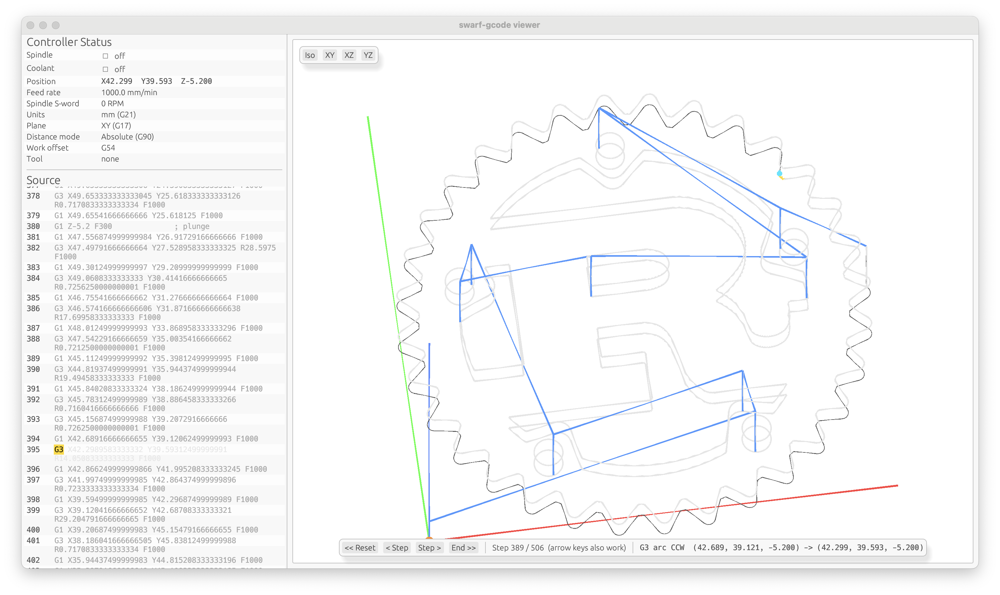

# Swarf

A family of Rust crates filling the gaps in the ecosystem for **CNC firmware
development**. The Rust world has mature G-code *parsers*, but little above
them: nothing that tracks modal state, plans motion, or drives steppers as
reusable, `no_std`-friendly building blocks. Swarf aims to be that missing
middle.

The project is being built bottom-up, one layer at a time. The first crate —
and the current focus — is the **interpreter**: the layer that turns parsed
G-code into concrete motion and machine commands.

## Architecture

The intended end-to-end pipeline, from serial bytes to real motion:

```
Serial bytes
  │
  ▼
[Interpreter]    ★      swarf-gcode: parses one line at a time (gcode crate's
  │                     zero-allocation visitor API), mutates persistent
  │                     modal state, validates modal-group conflicts, and
  │                     emits an ordered stream of resolved output (moves AND
  │                     non-motion commands, one sink, exact execution order
  │                     preserved). No dependency on anything below it.
  ▼
[Bridge]         ★      swarf-bridge: thin adapter translating swarf-gcode's
  │                     resolved output into swarf-motion's plain API - the
  │                     ONE place that knows both layers exist, so neither
  │                     lower crate has to depend on the other.
  ▼
[Motion planner] ★      swarf-motion: trajectory / acceleration planning,
  │                     look-ahead junction velocities, chord-tolerance arc
  │                     tessellation - generic over any motion source, not
  │                     tied to G-code at all.
  ▼
[Ring buffer]           bounded; backpressure stalls the interpreter when
  │                     full (see swarf-gcode's `Interpreter::step` docs)
  ▼
[Executor]              pops from the front, drives real motion
  ▲
  │
[Real-time channel]     feed hold / flush / overrides — bypasses the buffer
```

★ = the layer implemented today.

### Two real-time tiers

CNC firmware splits into two tiers with very different constraints, and the
crates above map onto them deliberately:

- **Tier A — interpretation & planning.** Where `swarf-gcode` and
  `swarf-motion` live. Soft deadline: "keep up with how fast the machine
  physically moves" (milliseconds to seconds per move). Rich abstractions are
  fine here — traits, generics, enums, fallible `Result`-returning APIs, even
  loops that aren't provably bounded at compile time (e.g. peck-drilling a
  deep hole). This mirrors where grblHAL's own `gc_execute_line()` and
  planner ring buffer live: the main loop, not an interrupt handler.
- **Tier B — trajectory execution.** Stepper ISR / step-pulse generation.
  Hard deadline: microseconds, every tick, no exceptions. Requires
  deterministic, branch-minimal, allocation-free, ISR-safe code —
  `swarf-step` (and the parts of `swarf-kinematics` invoked per-step, for
  machine geometries that need continuous inverse kinematics) belong here.

Interpretation never belongs in Tier B — no real controller parses G-code
inside a stepper ISR — and Tier-B constraints (bounded loops, no branching,
ISR safety) should never leak backward into `swarf-gcode` or `swarf-motion`.
Conversely, Tier-A abstractions have no place in whatever code actually runs
in the ISR. Keeping this boundary sharp as new crates land is a project-wide
design rule, not just a one-off decision in `swarf-gcode`.

## Crates

| Crate              | Status      | Tier | Role                                                             |
| ------------------ | ----------- | ---- | ----------------------------------------------------------------|
| `swarf-gcode`      | in progress | A    | G-code interpreter: G-code text → ordered motion/command output |
| `swarf-motion`     | in progress | A    | Trajectory / acceleration planner (the ring-buffer stage) - generic, no G-code dependency |
| `swarf-bridge`     | in progress | A    | Adapter: `swarf-gcode` output → `swarf-motion`'s plain API       |
| `swarf-kinematics` | planned     | A/B  | Cartesian / CoreXY / delta / lathe coordinate transforms         |
| `swarf-step`       | planned     | B    | Step/dir pulse generation and stepper timing                     |
| `swarf-hal`        | planned     | B    | Board / MCU hardware abstraction                                 |

## `swarf-gcode`

A NIST RS274NGC-compatible, modal-state G-code interpreter. It is the
equivalent of what grblHAL calls `gc_state` and what the NIST reference
implementation calls the interpreter proper — verified against:

- the NIST RS274NGC Interpreter Version 3 spec (modal groups, Table 4),
- grblHAL's `gc_state` / `gcode.c`, including its published supported-codes
  list, as a live reference,
- the `gcode` 0.7 crate's zero-allocation visitor API.

It is `no_std` and performs no heap allocation anywhere.

### What it supports today

- **Motion**: G0/G1 straight moves, G2/G3 arcs (I/J/K center form and R
  radius form, in all three planes G17/G18/G19).
- **Canned drilling cycles**: G81, G82, G83 (peck), G85, G86, G89, with
  G98/G99 retract-mode control (G17/XY plane only, one hole per line).
- **Non-modal positioning**: G28/G30 (return to a stored reference position,
  with G28.1/G30.1 to set it) and G53 (one-line machine-coordinate override).
- **Work coordinates**: G54–G59.3 selection (offsets preloaded by the host)
  and G92/G92.1 (set/cancel an additional origin shift).
- **Modal state**: plane, units (G20/G21), distance mode (G90/G91), arc
  IJK-distance mode, feed-rate mode (tracked).
- **Non-motion machine commands**, in the same ordered output stream as
  motion (not a separate, unordered channel): M3/M4/M5 spindle (with modal
  S), M7/M8/M9 coolant, M0/M1/M2/M30 program flow, T + M6 tool select/change,
  G4 dwell.
- **Modal-group conflict detection** per NIST Table 4 (e.g. `G0 G1 X10` on
  one line).

Deliberately **not yet** implemented (staged for later — see `swarf-gcode`'s
own crate docs for the full, current list): parameter/expression evaluation
(`#1`, `#<expr>`), block delete (`/`), G10, G92.2/G92.3, the `L` canned-cycle
repeat count, tool length offset, cutter compensation, threading, splines,
and lathe-specific codes (this crate targets mill motion first).

### Example

```rust
use swarf_gcode::{ErrorSink, Interpreter, InterpretError, LineOutput, OutputSink};

#[derive(Default)]
struct Outputs(Vec<LineOutput>);
impl OutputSink for Outputs {
    fn push(&mut self, output: LineOutput) -> Result<(), ()> {
        self.0.push(output);
        Ok(())
    }
}

#[derive(Default)]
struct Errors(Vec<InterpretError>);
impl ErrorSink for Errors {
    fn push(&mut self, error: InterpretError) {
        self.0.push(error);
    }
}

fn main() {
    let mut interp = Interpreter::new(Outputs::default(), Errors::default());
    interp.run("G21 G90\nG0 X10 Y0\nM3 S1000\nG1 X20 F300\n");
    let (outputs, errors) = interp.into_sinks();

    // Motion and non-motion output share one sink, in the exact order
    // the interpreter produced them - the G0, then the M3, then the G1.
    for output in &outputs.0 {
        println!("{output:?}");
    }
    for err in &errors.0 {
        eprintln!("error: {err:?}");
    }
}
```

For real-time / streaming use, feed the interpreter one line at a time with
`Interpreter::step` instead of `run`ning a whole program at once — see its
doc comment for the backpressure contract.

A ready-to-run trace tool lives at `swarf-gcode/examples/trace.rs`: it prints
a human-readable line-by-line trace of everything an interpreter run
resolves, and ships with a set of real-world G-code test files under
`swarf-gcode/examples/gcode_samples/` (third-party GPL-3.0 test data — see
that directory's `NOTICE.md`) to try it against:

```bash
cd swarf-gcode
cargo run --example trace -- examples/gcode_samples/arc_rword_test.gcode
```

There's also a step-through 3D toolpath viewer at
`swarf-bridge/examples/viewer/`: it interprets a whole program up front,
runs it through `swarf-motion`'s look-ahead planner (via `swarf-bridge`),
and lets you step forward/backward - or play it back at physically
correct, planned speed - through the resolved output while the toolpath
draws itself and the source line highlights in sync. It lives in
`swarf-bridge` rather than `swarf-gcode` specifically so it can animate
using real planned speeds without either of the two lower layers needing
to depend on the other.



```bash
cd swarf-bridge
cargo run --example viewer -- ../swarf-gcode/examples/gcode_samples/rust_logo.gcode
```

### Module map

| Module         | Responsibility                                                        |
| -------------- | ---------------------------------------------------------------------|
| `state`        | `ModalState` (Interface 1) — persistent, motion-scoped interpreter state |
| `modal_groups` | NIST Table 4 modal-group classification + allocation-free conflict set |
| `motion`       | `ResolvedMotionCommand` (Interface 2) — resolved moves, plus arc-center math |
| `command`      | `Command` (Interface 3) — non-motion effects (spindle, coolant, tool change, dwell, program flow) |
| `visitor`      | `Interpreter`, `OutputSink`/`LineOutput` (the combined output boundary), `ErrorSink` |

## Status & roadmap

- `swarf-gcode`, `swarf-motion`, and `swarf-bridge` all build `no_std`, no
  heap allocation anywhere (`swarf-bridge` and its examples are the only
  `std`-linked parts, and only because dev-tooling like the viewer needs it).
- Passes its combined test suite (99 tests + 3 doctests) on a current Rust
  toolchain.
- `swarf-motion` implements junction-deviation look-ahead planning
  (re-derived from grblHAL's `planner.c`, not copied) and chord-tolerance
  arc tessellation, verified against real files via `swarf-bridge`'s viewer
  and trace examples.
- Next step: **`swarf-kinematics`**/**`swarf-step`** (Tier B) - turning
  `swarf-motion`'s planned entry/nominal/exit speeds into actual per-axis
  step counts and step-pulse timing.

## Building

```bash
cargo build
cargo test
```

## License

Licensed under the [MIT License](LICENSE).
